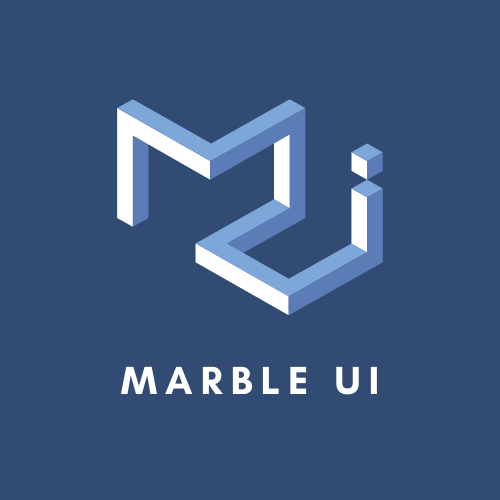

<h1 align="center">MarbleUI</h1>
<h2 align="center">

<!--lint disable no-literal-urls-->

  

</h2>

<b>MarbleUI</b> is a user interface framework that will be used with AppGameKit 2  
in the <b>php-appgamekit-ext</b> template. 
It is written in PHP and is under development.

---
